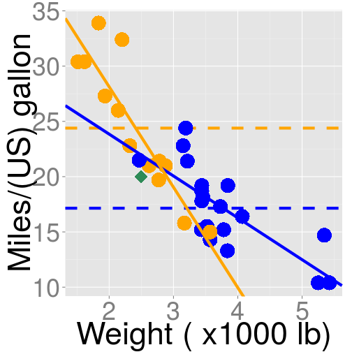

Exploring Mtcars Dataset
========================================================
author: L.P.
date: Sat Sep 19 20:57:54 2015
transition: rotate

Main Goal
========================================================

- Perform an exploratory data analysis on the mtcars dataset
- Compare an external observation with the existing dataset
- Introduce tools that can be used to deal with other datasets and other types of analyses

Mtcars Dataset
========================================================

The dataset has 32 car make and model observations with 11 variables,
including:
- Miles/(US) gallon (mpg)
- Weight (lb/1000) (wt)
- Gross horsepower (hp)
- Transmission type (am: 0 = auto, 1 = manual)
- Number of cylinders (cyl)


```r
head(mtcars[,c(1,2,4,6,9)],1)
```

```
          mpg cyl  hp   wt am
Mazda RX4  21   6 110 2.62  1
```

Application Inputs and Outputs
=======================================================

Inputs:
- Choose data points, car make and models, by clicking on checkboxes
- Choose one out of six types of analyses performed on the data points
- Optional: Add or erase an external observation ('my car')
by hitting the Submit or Clear button

***

Outputs:
- A boxplot or a scatterplot with one or two regression lines
- Description under the plot with values of regression line intercept(s) and slope(s) when appropriate.
- Table displaying the data points with the external observation 'my car', if included.


Example and Future Directions
========================================================
left: 35%
width: 1920
height: 1080

 
<small>

```r
lm(mpg ~ wt + am + am*wt, mtcars)
```
</small>


***

- <small> Scatterplot of mpg vs. weight is shown with two regression lines: 
automatic (blue) and manual (orange) transmission.</small>
- <small> Dotted lines: automatic and manual mpg means, disregarding car weight.</small>
- <small> Disregarding weight, the manual transmission performs better (7.3 mpg above the automatic). Including weight, 
manual transmission has better mpg for lighter cars, automatic is better for heavier cars.</small>
- <small> Similar analysis can be performed for other types of plots and datasets.</small>


